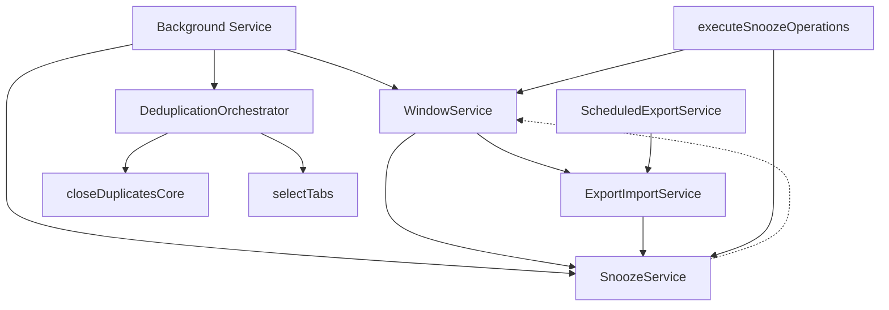

# Phase 9: Service Documentation - Implementation Prompt

## Context
TabMaster Pro has completed its architectural refactoring (Phases 1-8) to a services-first architecture. All business logic now lives in services, and all surfaces are thin presentation layers. However, comprehensive documentation is lacking, making it difficult for new contributors to understand the service architecture.

**Current State:**
- ✅ All refactoring complete (Phases 1-8)
- ✅ `/services/ARCHITECTURE.md` exists (architectural guidelines)
- ⚠️ Individual services have minimal JSDoc comments
- ❌ No service usage examples
- ❌ No service dependency diagram
- ❌ CLAUDE.md doesn't list all services

## Objective
Create comprehensive documentation for all services to enable efficient onboarding and maintenance.

## Service Inventory

### Execution Services (`/services/execution/`)
1. **BookmarkService.js** - Bookmark tab creation and folder management
2. **closeDuplicatesCore.js** - Core duplicate detection and closure logic (internal)
3. **DeduplicationOrchestrator.js** - Orchestrates deduplication across scopes
4. **executeSnoozeOperations.js** - Executes snooze operations (windows/tabs)
5. **groupTabs.js** - Tab grouping execution
6. **ScheduledExportService.js** - Automatic backup scheduling with chrome.alarms
7. **SnoozeService.js** - Tab/window snoozing and restoration
8. **SuspensionService.js** - Tab suspension (chrome.tabs.discard)
9. **TabActionsService.js** - Basic tab operations (close, pin, mute, move)
10. **WindowService.js** - Window-level operations and metadata

### Selection Services (`/services/selection/`)
1. **detectSnoozeOperations.js** - Smart window detection for snooze
2. **selectAndPlan.js** - Rule-based tab selection and command planning
3. **selectTabs.js** - Generalized tab filtering and selection

### Utility Services (`/services/`)
1. **ExportImportService.js** - Data export/import (JSON/CSV/Markdown)
2. **TabGrouping.js** - Legacy service (may need deprecation note)
3. **utils/snoozeFormatters.js** - UI formatting for snooze operations

### Other
- **lib/utils/time.js** - Duration parsing utilities
- **lib/normalize.js** - URL normalization for duplicate detection

## Tasks

### 9.1 Service API Documentation

For each service file, add comprehensive JSDoc documentation:

#### 9.1.1 File-Level Documentation
Add at the top of each service:
```javascript
/**
 * @file [Service Name] - [One-line purpose]
 *
 * @description
 * [2-3 paragraphs explaining]:
 * - What this service does
 * - Why it exists (what problem it solves)
 * - Key responsibilities
 *
 * @module services/[category]/[ServiceName]
 *
 * @architecture
 * - Layer: [Execution/Selection/Utility]
 * - Dependencies: [List service dependencies]
 * - Used By: [List surfaces/services that call this]
 *
 * @example
 * // Basic usage example
 * import * as ServiceName from './services/execution/ServiceName.js';
 *
 * const result = await ServiceName.mainFunction(params);
 */
```

#### 9.1.2 Function-Level Documentation
Enhance existing JSDoc for all exported functions:
```javascript
/**
 * [Function purpose - one line]
 *
 * [2-3 sentences explaining what the function does and when to use it]
 *
 * @param {Type} paramName - Description
 * @param {Object} [options] - Optional parameters
 * @param {Type} [options.key] - Description
 *
 * @returns {Promise<Type>} Description of return value
 *
 * @throws {Error} When [condition that causes error]
 *
 * @example
 * // Common usage
 * const result = await functionName(param1, { option: value });
 *
 * @example
 * // Edge case
 * const result = await functionName([], { allowEmpty: true });
 */
```

**Priority Order:**
1. **HIGH**: Services with complex APIs
   - SnoozeService.js (already has good docs - review and enhance)
   - WindowService.js
   - DeduplicationOrchestrator.js
   - ScheduledExportService.js
   - ExportImportService.js

2. **MEDIUM**: Services with moderate complexity
   - TabActionsService.js
   - executeSnoozeOperations.js
   - detectSnoozeOperations.js
   - selectTabs.js

3. **LOW**: Simple services
   - BookmarkService.js
   - SuspensionService.js
   - groupTabs.js
   - snoozeFormatters.js

### 9.2 Service Usage Examples

Create `/docs/service-usage-examples.md` with real-world examples:

```markdown
# Service Usage Examples

## Common Patterns

### Tab Operations
[How to close/group/snooze tabs via services]

### Window Operations
[How to snooze/restore windows]

### Deduplication
[How to find and close duplicates at different scopes]

### Export/Import
[How to create backups and restore data]

### Scheduling
[How to set up automatic operations]

## Cross-Service Workflows

### Example 1: Snooze Window with Restoration
[Show how WindowService → SnoozeService coordination works]

### Example 2: Deduplicate Across All Windows
[Show how DeduplicationOrchestrator uses selectTabs + closeDuplicatesCore]

### Example 3: Create Scheduled Backup
[Show how ScheduledExportService → ExportImportService works]

## Error Handling Patterns

### Graceful Degradation
[Examples of services handling missing data]

### Retry Logic
[Examples of chrome.alarms retry patterns]

### Cache Consistency
[Examples of proper storage update patterns]
```

### 9.3 Service Dependency Diagram

Create `/docs/service-dependencies.md` with visual dependency graph:

```markdown
# Service Dependencies

## Execution Services Dependencies

### No Dependencies (Leaf Services)
- BookmarkService
- SuspensionService
- TabActionsService (partially - only calls Chrome APIs)

### Service-to-Service Dependencies

#### WindowService
- **Depends On**:
  - SnoozeService (for tab snoozing)
  - ExportImportService (for window restoration)
- **Used By**:
  - executeSnoozeOperations
  - Background context menus

#### SnoozeService
- **Depends On**:
  - WindowService.cleanupOrphanedWindowMetadata (circular - careful!)
- **Used By**:
  - WindowService
  - executeSnoozeOperations
  - Background message handlers
  - Rules engine (v2)

[Continue for all services...]

## Dependency Graph (Mermaid)



## Circular Dependencies to Watch

[Document known circular dependencies and how they're managed]

```

### 9.4 Update CLAUDE.md

Add comprehensive service section to `/tabmaster-pro/CLAUDE.md`:

```markdown
## Service Directory

TabMaster Pro follows a strict services-first architecture. ALL business logic lives in services.

### Execution Services (`/services/execution/`)
Services that modify state and call Chrome APIs:

- **BookmarkService** - Create bookmarks and manage bookmark folders
- **closeDuplicatesCore** (internal) - Core duplicate closure logic
- **DeduplicationOrchestrator** - Entry point for all deduplication (global/per-window/window scopes)
- **executeSnoozeOperations** - Coordinate snooze execution across windows/tabs
- **groupTabs** - Tab grouping with options (by-domain, custom names, etc.)
- **ScheduledExportService** - Automatic backups with chrome.alarms (hourly/daily/weekly)
- **SnoozeService** - Tab/window snoozing with restoration modes
- **SuspensionService** - Tab suspension (chrome.tabs.discard) with filters
- **TabActionsService** - Basic tab operations (close, pin, mute, move)
- **WindowService** - Window operations, snooze coordination, deduplication

### Selection Services (`/services/selection/`)
Services that filter and select entities (read-only):

- **detectSnoozeOperations** - Smart detection of window vs tab snooze operations
- **selectAndPlan** - Rule-based selection and command planning
- **selectTabs** - Generalized tab filtering by criteria

### Utility Services (`/services/`)
Standalone utilities:

- **ExportImportService** - Export/import in JSON/CSV/Markdown formats
- **TabGrouping** - Legacy grouping service (deprecated - use groupTabs)
- **utils/snoozeFormatters** - UI formatting functions for snooze operations

### Cross-Service Patterns

#### Service-to-Service Dependencies
Execution services MAY depend on other execution services:
- ✅ WindowService → SnoozeService (same layer)
- ✅ ScheduledExportService → ExportImportService (same layer)
- ✅ DeduplicationOrchestrator → closeDuplicatesCore (orchestrator pattern)

Selection services MUST NOT depend on execution services:
- ❌ selectTabs → groupTabs (wrong direction)
- ✅ groupTabs → selectTabs (correct direction)

#### Message Passing Pattern
All UI surfaces use message passing:
```javascript
// UI Surface (popup/dashboard/session)
const result = await chrome.runtime.sendMessage({
  action: 'serviceName',
  params: { ... }
});

// Background Handler
case 'serviceName':
  const result = await ServiceName.function(message.params);
  sendResponse(result);
  break;
```

#### Direct Call Pattern
Background and context menus use direct service calls:
```javascript
// background-integrated.js
import * as ServiceName from './services/execution/ServiceName.js';

const result = await ServiceName.function(params);
```

For complete service usage examples, see `/docs/service-usage-examples.md`
```

## Acceptance Criteria

- [ ] All 15 services have comprehensive file-level JSDoc
- [ ] All exported functions have complete JSDoc with examples
- [ ] `/docs/service-usage-examples.md` created with 10+ real examples
- [ ] `/docs/service-dependencies.md` created with Mermaid diagram
- [ ] `CLAUDE.md` updated with complete service directory
- [ ] No services left undocumented
- [ ] All circular dependencies explained
- [ ] Common patterns documented with examples
- [ ] Error handling patterns documented

## Implementation Notes

1. **Start with High-Priority Services** - SnoozeService, WindowService, DeduplicationOrchestrator
2. **Use Existing Docs as Template** - SnoozeService already has good structure
3. **Test Examples** - All code examples must be tested and work
4. **Keep It Practical** - Focus on real-world usage, not theoretical scenarios
5. **Document Gotchas** - Call out chrome.alarms persistence, service worker restarts, etc.
6. **Cross-Reference** - Link between related services in documentation

## Time Estimate
- 9.1 Service API Documentation: 6-8 hours (15 services × 20-30 min each)
- 9.2 Service Usage Examples: 3-4 hours
- 9.3 Service Dependency Diagram: 2-3 hours
- 9.4 Update CLAUDE.md: 1-2 hours
- **Total: 12-17 hours**

## Related Files
- `/services/ARCHITECTURE.md` - Existing architectural guidelines
- `/TODO.md` - Phase 9 tracking
- `/tabmaster-pro/CLAUDE.md` - Main architecture document
- All service files in `/services/`

## Success Metrics
- New contributor can understand service architecture in < 30 minutes
- All service APIs are clear without reading implementation
- Common workflows have copy-paste examples
- Zero ambiguity about which service to use for a task
- Architecture violations are caught by clear guidelines
