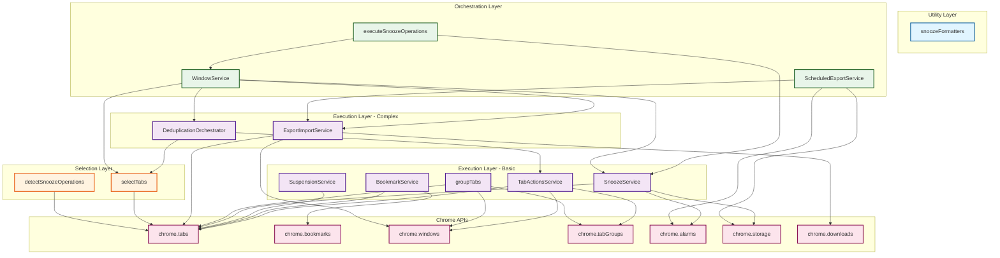
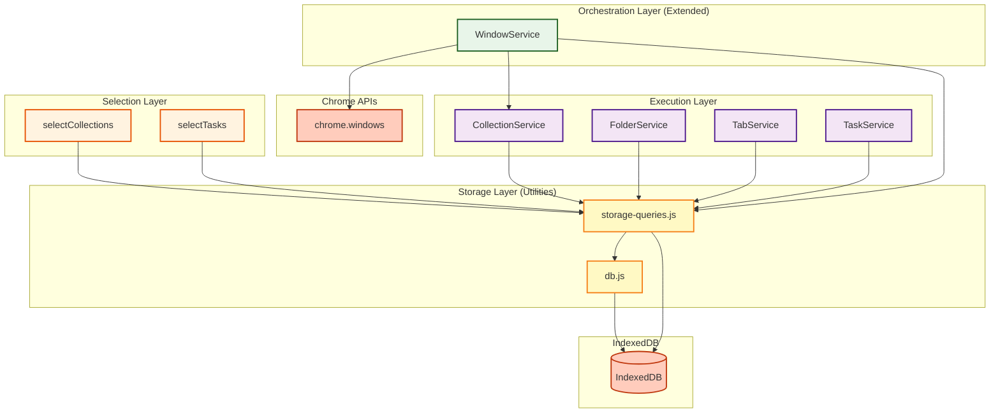

# Service Dependencies

Visual map of how TabMaster Pro (13 services) and TabTaskTick (8 services) depend on each other and Chrome/IndexedDB APIs.

## Architecture Layers

Services are organized into 5 architectural layers:

1. **Storage Layer** - IndexedDB utilities (TabTaskTick only)
2. **Selection Layer** - Filtering and detection (read-only)
3. **Execution Layer** - State modification and operations
4. **Orchestration Layer** - Coordination of multiple services
5. **Utility Layer** - Pure helper functions

---

## TabMaster Pro Dependency Diagram



---

## TabTaskTick Dependency Diagram



---

## Service Dependency Matrix

### TabMaster Pro Services

| Service | Layer | Depends On | Used By |
|---------|-------|------------|---------|
| **snoozeFormatters** | Utility | None (pure functions) | UI surfaces (popup, dashboard) |
| **listeners** (safeAsyncListener) | Utility | None | Background event handlers (alarms, tabs, windows, storage) |
| **selectTabs** | Selection | chrome.tabs | All orchestrators, rules engine |
| **detectSnoozeOperations** | Selection | chrome.tabs | executeSnoozeOperations, UI |
| **TabActionsService** | Execution | chrome.tabs, chrome.tabGroups, chrome.windows | DeduplicationOrchestrator, rules engine |
| **BookmarkService** | Execution | chrome.bookmarks, chrome.tabs | Rules engine, context menus |
| **SuspensionService** | Execution | chrome.tabs | Rules engine, bulk actions |
| **SnoozeService** | Execution | chrome.tabs, chrome.alarms, chrome.storage | WindowService, executeSnoozeOperations |
| **groupTabs** | Execution | chrome.tabs, chrome.tabGroups, chrome.windows | Rules engine, bulk actions |
| **ExportImportService** | Execution | chrome.tabs, chrome.windows, chrome.downloads | WindowService, ScheduledExportService |
| **DeduplicationOrchestrator** | Execution | selectTabs, TabActionsService | WindowService, rules engine |
| **executeSnoozeOperations** | Orchestrator | WindowService, SnoozeService | Background handlers, UI |
| **WindowService** | Orchestrator | SnoozeService, ExportImportService, selectTabs, DeduplicationOrchestrator, CollectionService (TabTaskTick) | executeSnoozeOperations, context menus |
| **ScheduledExportService** | Orchestrator | ExportImportService, chrome.alarms, chrome.storage | Background alarm handlers |

### TabTaskTick Services

| Service | Layer | Depends On | Used By |
|---------|-------|------------|---------|
| **db.js** | Storage (Utility) | IndexedDB | storage-queries.js, all services (via queries) |
| **storage-queries.js** | Storage (Utility) | db.js, IndexedDB | All execution/selection services |
| **selectCollections** | Selection | storage-queries.js | UI surfaces, WindowService |
| **selectTasks** | Selection | storage-queries.js | UI surfaces |
| **CollectionService** | Execution | storage-queries.js | WindowService, background handlers, UI |
| **FolderService** | Execution | storage-queries.js | Background handlers, UI |
| **TabService** | Execution | storage-queries.js | Background handlers, UI |
| **TaskService** | Execution | storage-queries.js | Background handlers, UI |
| **WindowService (extended)** | Orchestrator | CollectionService, storage-queries.js, chrome.windows | Background event handlers |

---

## Dependency Chains

### TabMaster Pro Chains

#### Longest Chain: Window Snooze

```
UI Surface
  ↓
detectSnoozeOperations (Selection)
  ↓
executeSnoozeOperations (Orchestrator)
  ↓
WindowService (Orchestrator)
  ↓ (delegates to)
SnoozeService (Execution)
  ↓
chrome.tabs / chrome.alarms (Chrome API)
```

**Depth**: 6 layers

**Why so deep**: Window operations require complex orchestration - must capture window metadata, delegate tab snoozing, coordinate restoration. Each layer adds specific value.

#### Scheduled Backup Chain

```
chrome.alarms (Trigger)
  ↓
ScheduledExportService (Orchestrator)
  ↓
ExportImportService (Execution)
  ↓
chrome.tabs / chrome.downloads (Chrome API)
```

**Depth**: 4 layers

**Why**: Simpler than snooze - just coordinate export timing and file management.

#### Deduplication Chain

```
UI Surface
  ↓
selectTabs (Selection with duplicates filter)
  ↓
DeduplicationOrchestrator (Execution)
  ↓
TabActionsService (Execution)
  ↓
chrome.tabs (Chrome API)
```

**Depth**: 5 layers

**Why**: Requires duplicate detection (selection) then closure (execution).

### TabTaskTick Chains

#### Collection Binding Chain

```
chrome.windows.onRemoved (Event)
  ↓
WindowService.onRemoved listener (Orchestrator)
  ↓
CollectionService.unbindFromWindow (Execution)
  ↓
storage-queries.saveCollection (Storage Utility)
  ↓
db.withTransaction (Storage Utility)
  ↓
IndexedDB (Database)
```

**Depth**: 5 layers (Event → Orchestrator → Execution → Storage Utilities → Database)

**Why**: Requires event handling, state coordination, transaction management, and persistent storage. WindowService acts as orchestrator between Chrome events and execution services.

#### Task Query Chain

```
UI Surface
  ↓
selectTasks (Selection)
  ↓
storage-queries.getTasksByIndex (Storage Utility)
  ↓
db.withTransaction (Storage Utility)
  ↓
IndexedDB (Database)
```

**Depth**: 5 layers

**Why**: Normalized data model requires index-based queries through storage utilities.

#### Collection CRUD Chain

```
UI Surface
  ↓
CollectionService.createCollection (Execution)
  ↓
storage-queries.saveCollection (Storage Utility)
  ↓
db.withTransaction (Storage Utility)
  ↓
IndexedDB (Database)
```

**Depth**: 5 layers

**Why**: Standard CRUD pattern through normalized storage layer with transaction management.

---

## Important Service Relationships

### TabMaster Pro Relationships

#### SnoozeService ↔ WindowService

**Type**: Mutual dependency

**Why**:
- `WindowService` calls `SnoozeService.snoozeTabs()` to snooze individual tabs
- `SnoozeService` calls `WindowService.cleanupOrphanedWindowMetadata()` for periodic cleanup

**Pattern**: This is acceptable because they serve different purposes:
- SnoozeService: Core snooze/wake operations
- WindowService: Window-level orchestration and metadata management

**Note**: This is the only circular dependency in TabMaster Pro services.

#### WindowService → ExportImportService

**Type**: Logic reuse

**Why**: WindowService reuses ExportImportService's 137-line battle-tested window creation/restoration logic for window snooze restoration.

**Pattern**: DRY principle - no code duplication, single source of truth for complex window operations.

#### DeduplicationOrchestrator → selectTabs

**Type**: URL normalization

**Why**: Deduplication uses `selectTabs.normalizeUrlForDuplicates()` for consistent URL comparison across all deduplication operations.

**Pattern**: Centralized normalization logic ensures YouTube video IDs, Google searches, etc. are handled consistently.

### TabTaskTick Relationships

#### All Services → storage-queries.js

**Type**: Mandatory storage abstraction

**Why**: All execution and selection services MUST use storage-queries.js utilities, never directly access IndexedDB.

**Pattern**: Enforced architecture rule - prevents transaction mismanagement, ensures consistent error handling, centralizes database access patterns.

**Example**:
- ✅ `CollectionService.createCollection()` → `storage-queries.saveCollection()`
- ❌ `CollectionService.createCollection()` → `db.getDB().put()` (forbidden)

#### WindowService → CollectionService

**Type**: Collection lifecycle management

**Why**: WindowService extended with collection binding methods that delegate to CollectionService for state changes.

**Pattern**: Orchestrator delegates to execution service - WindowService coordinates window events, CollectionService manages collection state.

**Methods**:
- `WindowService.bindCollectionToWindow()` → `CollectionService.bindToWindow()`
- `WindowService.unbindCollectionFromWindow()` → `CollectionService.unbindFromWindow()`

#### storage-queries.js → db.js

**Type**: Transaction wrapper dependency

**Why**: All database operations MUST use `db.withTransaction()` for proper error handling and rollback.

**Pattern**: Every storage-queries function wraps its operations in `withTransaction()`, ensuring atomic operations and preventing data corruption.

**Example**:
```javascript
// storage-queries.js
export async function saveCollection(collection) {
  return withTransaction(['collections'], 'readwrite', async (tx) => {
    const store = tx.objectStore('collections');
    await store.put(collection);
  });
}
```

---

## Service Isolation

### TabMaster Pro Services

#### Services with Zero Service Dependencies

These services have no dependencies on other services (only Chrome APIs):

1. **snoozeFormatters** - Pure utility functions
2. **selectTabs** - Self-contained selection logic
3. **detectSnoozeOperations** - Self-contained detection
4. **TabActionsService** - Thin Chrome API wrappers
5. **BookmarkService** - Thin Chrome API wrapper
6. **SuspensionService** - Thin Chrome API wrapper
7. **groupTabs** - Self-contained grouping logic
8. **ExportImportService** - Self-contained data management

**Benefit**: These services can be tested in isolation with mocked Chrome APIs.

#### Services with Service Dependencies

These services orchestrate multiple other services:

1. **SnoozeService** → WindowService (cleanup only)
2. **DeduplicationOrchestrator** → selectTabs, TabActionsService
3. **executeSnoozeOperations** → WindowService, SnoozeService
4. **WindowService** → SnoozeService, ExportImportService, selectTabs, DeduplicationOrchestrator, CollectionService (TabTaskTick)
5. **ScheduledExportService** → ExportImportService

**Benefit**: Clear separation of orchestration from execution.

### TabTaskTick Services

#### Storage Layer (Zero Business Logic)

These are utilities, not services - they contain NO business logic:

1. **db.js** - IndexedDB connection management, transaction wrappers
2. **storage-queries.js** - Simple CRUD operations with foreign key handling

**Benefit**: Can be tested with fake-indexeddb (no Chrome API mocks needed).

**Architecture Rule**: These utilities are ONLY called by execution services, never by UI code.

#### Services with Storage-Only Dependencies

These services have no service dependencies (only storage utilities):

1. **selectCollections** → storage-queries.js only
2. **selectTasks** → storage-queries.js only
3. **CollectionService** → storage-queries.js only
4. **FolderService** → storage-queries.js only
5. **TabService** → storage-queries.js only
6. **TaskService** → storage-queries.js only

**Benefit**: Clean separation - all business logic in services, all data access in utilities.

#### Orchestrator with Dependencies

1. **WindowService (extended)** → CollectionService, storage-queries.js, chrome.windows

**Benefit**: Single orchestrator coordinates window events, collection state, and cache management.

---

## API Usage Patterns

### TabMaster Pro - Chrome APIs

#### Frequently Used APIs

1. **chrome.tabs** (10 services)
   - TabActionsService, BookmarkService, SuspensionService, SnoozeService
   - groupTabs, ExportImportService, selectTabs, detectSnoozeOperations, DEDUP, WINDOW

2. **chrome.storage** (2 services)
   - SnoozeService (tab metadata)
   - ScheduledExportService (backup metadata)

3. **chrome.alarms** (2 services)
   - SnoozeService (wake-up scheduling)
   - ScheduledExportService (backup scheduling)

#### API Surface Area

| Service | Chrome APIs Used | API Count |
|---------|------------------|-----------|
| TabActionsService | tabs, tabGroups, windows | 3 |
| groupTabs | tabs, tabGroups, windows | 3 |
| ExportImportService | tabs, windows, downloads | 3 |
| SnoozeService | tabs, alarms, storage | 3 |
| ScheduledExportService | alarms, storage (+ ExportImportService) | 2 |
| BookmarkService | bookmarks, tabs | 2 |
| WindowService | windows (via TabTaskTick extension) | 1* |
| SuspensionService | tabs | 1 |
| selectTabs | tabs | 1 |
| detectSnoozeOperations | tabs | 1 |
| DeduplicationOrchestrator | (via other services) | 0 |
| executeSnoozeOperations | (via other services) | 0 |
| snoozeFormatters | None | 0 |

*WindowService TabTaskTick extension uses chrome.windows directly for event listeners (onRemoved, onFocusChanged)

### TabTaskTick - IndexedDB & Chrome APIs

#### Database Usage

**IndexedDB** - Primary storage (via utilities):
- **db.js** - Direct IndexedDB connection management
- **storage-queries.js** - All CRUD operations via transactions
- All 6 execution/selection services - Indirect via storage-queries.js

**chrome.windows** - Window lifecycle tracking:
- WindowService (extended) - For collection binding/unbinding

#### API Surface Area

| Service | APIs Used | API Count |
|---------|-----------|-----------|
| db.js | IndexedDB | 1 |
| storage-queries.js | IndexedDB (via db.js) | 1 |
| selectCollections | IndexedDB (via storage-queries) | 1 |
| selectTasks | IndexedDB (via storage-queries) | 1 |
| CollectionService | IndexedDB (via storage-queries) | 1 |
| FolderService | IndexedDB (via storage-queries) | 1 |
| TabService | IndexedDB (via storage-queries) | 1 |
| TaskService | IndexedDB (via storage-queries) | 1 |
| WindowService (extended) | IndexedDB (via storage-queries), chrome.windows | 2 |

**Architecture Note**: No service directly accesses IndexedDB - all go through storage-queries.js → db.js chain.

### Async Event Listener Pattern

**Critical Pattern**: Chrome event listeners MUST NOT use `async` directly - use `safeAsyncListener` utility

```javascript
import { safeAsyncListener } from './services/utils/listeners.js';

// ❌ WRONG - Returns Promise, causes race conditions
chrome.alarms.onAlarm.addListener(async (alarm) => {
  await SnoozeService.handleAlarm(alarm);
});

// ✅ CORRECT - Uses safeAsyncListener wrapper
chrome.alarms.onAlarm.addListener(safeAsyncListener(async (alarm) => {
  await SnoozeService.handleAlarm(alarm);
}));
```

**Why**: Async functions return Promises. Chrome expects `true` (keep channel open) or `undefined` (close channel), NOT a Promise.

**Exception**: `chrome.runtime.onMessage` needs `sendResponse` callback, uses manual IIFE:

```javascript
chrome.runtime.onMessage.addListener((message, sender, sendResponse) => {
  (async () => {
    const result = await handleMessage(message);
    sendResponse(result);
  })();
  return true; // Keep channel open
});
```

**Utility Location**: `/services/utils/listeners.js`
- `safeAsyncListener(handler, options)` - Wraps async handlers safely
- `isAsyncFunction(fn)` - Checks if function is async (for validation)

**See**: [CLAUDE.md - Async Listener Pattern](../CLAUDE.md#async-listener-pattern-critical) for full documentation

---

## Dependency Rules

### ✅ Allowed Patterns

#### TabMaster Pro Rules

1. **Execution → Chrome APIs**
   - Direct Chrome API usage for operations
   - Example: `SnoozeService` → `chrome.tabs.remove()`

2. **Orchestrator → Execution Services**
   - Orchestrators coordinate execution services
   - Example: `WindowService` → `SnoozeService.snoozeTabs()`

3. **Orchestrator → Selection Services**
   - Orchestrators use selection for filtering
   - Example: `WindowService` → `selectTabs()`

4. **Execution → Selection Services**
   - Execution can use selection utilities
   - Example: `DeduplicationOrchestrator` → `selectTabs.normalizeUrlForDuplicates()`

5. **Service → Same Layer Service (limited)**
   - Allowed when reusing logic (DRY principle)
   - Example: `WindowService` → `ExportImportService` (window restoration logic)

#### TabTaskTick Rules

1. **All Services → storage-queries.js (MANDATORY)**
   - ALL data access MUST go through storage utilities
   - Example: `CollectionService.createCollection()` → `storage-queries.saveCollection()`
   - Forbidden: Direct IndexedDB access from any service

2. **storage-queries.js → db.withTransaction() (MANDATORY)**
   - ALL database operations MUST use transaction wrapper
   - Example: Every function in storage-queries.js wraps operations in `withTransaction()`
   - Ensures atomic operations and rollback on errors

3. **Selection Services → storage-queries.js only**
   - Selection services have NO business logic, just query utilities
   - Example: `selectCollections()` → `storage-queries.getCollectionsByIndex()`

4. **Execution Services → storage-queries.js + business logic**
   - Execution services contain business logic, delegate storage
   - Example: `CollectionService.updateCollection()` validates, then calls `storage-queries.saveCollection()`

5. **Orchestrator → Execution + Storage**
   - WindowService coordinates events, calls CollectionService, queries database
   - Example: `WindowService.bindCollectionToWindow()` → `CollectionService.bindToWindow()`

### ❌ Forbidden Patterns

#### TabMaster Pro Violations

1. **Selection → Execution**
   - Selection layer is read-only, cannot modify state
   - Example: ❌ `selectTabs` → `closeTabs()`

2. **Execution → Orchestrator**
   - Execution services should be self-contained
   - Example: ❌ `SnoozeService` → `WindowService` (except cleanup)

3. **UI → Multiple Services (without orchestrator)**
   - UI should call orchestrators for complex workflows
   - Example: ❌ UI directly calling both `WindowService` and `SnoozeService`
   - Correct: UI → `executeSnoozeOperations` → coordinates services

4. **Deep Circular Dependencies**
   - Avoid circular chains (A → B → C → A)
   - Current exception: SnoozeService ↔ WindowService (shallow, justified)

#### TabTaskTick Violations

1. **Direct IndexedDB Access (STRICTLY FORBIDDEN)**
   - Services NEVER call `db.getDB()` or `indexedDB.open()` directly
   - Example: ❌ `CollectionService` → `db.getDB().transaction()`
   - Correct: ✅ `CollectionService` → `storage-queries.saveCollection()` → `db.withTransaction()`

2. **Business Logic in Storage Layer (FORBIDDEN)**
   - storage-queries.js and db.js contain ZERO business logic
   - Example: ❌ storage-queries.js validating collection names
   - Correct: ✅ CollectionService validates, storage-queries.js just saves

3. **UI → Storage Utilities (FORBIDDEN)**
   - UI code NEVER calls storage-queries.js or db.js directly
   - Example: ❌ sidepanel.js → `storage-queries.getCollection()`
   - Correct: ✅ sidepanel.js → message → background → `CollectionService` or `selectCollections()`

4. **Skipping Transaction Wrapper (FORBIDDEN)**
   - All IndexedDB operations MUST use `withTransaction()`
   - Example: ❌ Direct `store.put()` without transaction wrapper
   - Correct: ✅ `withTransaction(['collections'], 'readwrite', async (tx) => { ... })`

---

## Extension Points

When adding new features, follow these patterns:

### Adding New Selection Logic

```javascript
// services/selection/selectMyNewCriteria.js
export async function selectTabsByCriteria(criteria) {
  // Use Chrome APIs for selection
  const tabs = await chrome.tabs.query({...});
  // Apply custom filtering
  return filtered;
}
```

**Dependencies**: Chrome APIs only

**Used By**: New orchestrators or UI surfaces

### Adding New Execution Operation

```javascript
// services/execution/MyNewOperation.js
export async function performOperation(tabIds, options) {
  // Execute operation on provided tab IDs
  for (const tabId of tabIds) {
    await chrome.tabs.someOperation(tabId, options);
  }
  return results;
}
```

**Dependencies**: Chrome APIs only (maybe selection utilities)

**Used By**: Orchestrators, rules engine, bulk actions

### Adding New Orchestrator

```javascript
// services/execution/MyComplexOrchestrator.js
import { selectTabs } from '../selection/selectTabs.js';
import { operation1 } from './Operation1Service.js';
import { operation2 } from './Operation2Service.js';

export async function orchestrateComplex(params) {
  // 1. Selection
  const tabs = await selectTabs({ criteria });

  // 2. Coordinate multiple operations
  const result1 = await operation1(tabs, params);
  const result2 = await operation2(result1.output, params);

  return { result1, result2 };
}
```

**Dependencies**: Selection services, Execution services

**Used By**: UI surfaces, background handlers

---

## Dependency Testing

### TabMaster Pro Testing

#### Isolated Testing (Zero Dependencies)

These services can be tested with only Chrome API mocks:

- snoozeFormatters (no mocks needed - pure functions)
- TabActionsService
- BookmarkService
- SuspensionService
- groupTabs
- ExportImportService

#### Integration Testing (Service Dependencies)

These services require other service mocks:

- DeduplicationOrchestrator (needs selectTabs)
- executeSnoozeOperations (needs WindowService, SnoozeService)
- WindowService (needs SnoozeService, ExportImportService, CollectionService)
- ScheduledExportService (needs ExportImportService)

#### Testing Strategy

```javascript
// 1. Unit test with Chrome API mocks
const mockChrome = { tabs: { query: async () => [...] } };
const result = await selectTabs({ filters }, mockChrome);

// 2. Integration test with service mocks
const mockSnoozeService = { snoozeTabs: async () => ({...}) };
const result = await WindowService.snoozeWindow(123, duration, {
  snoozeService: mockSnoozeService
});

// 3. End-to-end test with real Chrome APIs
// Use Playwright or similar for actual Chrome instance
```

### TabTaskTick Testing

#### Storage Layer Testing (Isolated)

Storage utilities can be tested with fake-indexeddb (no Chrome mocks needed):

- db.js - Connection, transactions, error handling
- storage-queries.js - CRUD operations, cascade deletes, batch operations

**Test Environment**: Jest + fake-indexeddb v6.2.3

**Known Limitation**: Index queries return empty arrays in fake-indexeddb (requires manual testing or E2E)

#### Service Layer Testing (Storage Mock)

All services can be tested by mocking storage-queries.js:

- selectCollections (needs getCollectionsByIndex mock)
- selectTasks (needs getTasksByIndex mock)
- CollectionService (needs saveCollection, getCollection, deleteCollection mocks)
- FolderService (needs saveFolder, deleteFolder mocks)
- TabService (needs saveTab, deleteTab mocks)
- TaskService (needs saveTask, getTask, deleteTask mocks)

#### Orchestrator Testing (Service Mock)

WindowService extended methods need CollectionService mocks:

- bindCollectionToWindow (needs CollectionService.bindToWindow mock)
- unbindCollectionFromWindow (needs CollectionService.unbindFromWindow mock)
- getCollectionForWindow (needs storage-queries.getCollectionsByIndex mock)

#### Testing Strategy

```javascript
// 1. Storage layer test with fake-indexeddb
import { initDB } from '/services/utils/db.js';
import { saveCollection, getCollection } from '/services/utils/storage-queries.js';

await initDB();
const collection = { id: 'test-123', name: 'Test Collection' };
await saveCollection(collection);
const retrieved = await getCollection('test-123');
expect(retrieved.name).toBe('Test Collection');

// 2. Service test with mocked storage utilities
import * as CollectionService from '/services/execution/CollectionService.js';

// Mock storage-queries.js
vi.mock('/services/utils/storage-queries.js', () => ({
  saveCollection: vi.fn(async (col) => col),
  getCollection: vi.fn(async (id) => ({ id, name: 'Mock Collection' }))
}));

const result = await CollectionService.createCollection({ name: 'Test' });
expect(result.id).toBeDefined();

// 3. E2E test with real Chrome + IndexedDB
// Use Playwright with Chrome extension loaded
test('collection persists across service worker restart', async ({ extensionId }) => {
  await page.evaluate(() => {
    return chrome.runtime.sendMessage({
      action: 'createCollection',
      params: { name: 'Test' }
    });
  });
  // Restart service worker, verify collection still exists
});
```

#### Test Coverage (Phase 2 Complete)

- **Unit Tests (Jest)**: 691 passing, 1 skipped (99.9% pass rate)
  - db.js: 20 tests
  - storage-queries.js: 43 tests
  - selectCollections: 23 tests
  - selectTasks: 24 tests
  - CollectionService: 23 tests
  - FolderService: 22 tests
  - TabService: 26 tests
  - TaskService: 32 tests
  - WindowService (extended): 24 tests

- **E2E Tests (Playwright)**: 22 passing
  - Message handlers: 19 tests
  - Window tracking: 2 passing, 1 manual (Test Runner scenario)

- **Manual Testing**: 5% (IndexedDB index queries in production Chrome)
  - See `/tests/KNOWN_LIMITATIONS.md` for manual validation checklist
  - Architectural decision: Maintain code cleanliness over perfect test metrics

---

## Diagram Legend

### TabMaster Pro Diagram

- **Orange boxes**: Selection layer (read-only, filtering)
- **Purple boxes**: Execution layer (state modification)
- **Green boxes**: Orchestration layer (coordination)
- **Blue boxes**: Utility layer (pure functions)
- **Pink boxes**: Chrome APIs (external dependencies)

### TabTaskTick Diagram

- **Yellow boxes**: Storage layer (utilities, no business logic)
- **Orange boxes**: Selection layer (read-only, filtering)
- **Purple boxes**: Execution layer (state modification)
- **Green boxes**: Orchestration layer (coordination)
- **Brown/Red boxes**: Database APIs (IndexedDB, chrome.windows)

---

## Circular Dependencies

### TabMaster Pro

**Current Status**: One circular dependency exists:

```
SnoozeService ↔ WindowService
```

**Why Acceptable**:
- SnoozeService → WindowService: Only for periodic cleanup (`cleanupOrphanedWindowMetadata`)
- WindowService → SnoozeService: For core snooze operations (`snoozeTabs`)
- Different concerns: one is data management, other is orchestration
- No initialization deadlock (both are lazy-initialized)

**Alternative Considered**: Extract window metadata cleanup into separate utility service. Decided against due to tight coupling with window snooze logic.

**Monitoring**: If more circular dependencies emerge, consider architectural refactor.

### TabTaskTick

**Current Status**: Zero circular dependencies

**Why Clean**:
- Storage layer (db.js, storage-queries.js) has NO service dependencies
- Selection services (selectCollections, selectTasks) depend only on storage layer
- Execution services (CollectionService, FolderService, TabService, TaskService) depend only on storage layer
- Orchestrator (WindowService) depends on execution services, never the reverse

**Architecture Benefit**: Unidirectional data flow prevents initialization issues and makes testing straightforward.

---

## Quick Reference Summary

### TabMaster Pro
- **Total Services**: 13
- **Circular Dependencies**: 1 (justified)
- **Storage**: chrome.storage.local
- **Primary APIs**: chrome.tabs, chrome.windows, chrome.tabGroups
- **Test Strategy**: Mock Chrome APIs

### TabTaskTick
- **Total Services**: 8 (6 services + 2 storage utilities)
- **Circular Dependencies**: 0
- **Storage**: IndexedDB (normalized model)
- **Primary APIs**: IndexedDB, chrome.windows (events only)
- **Test Strategy**: fake-indexeddb for unit tests, Playwright for E2E
