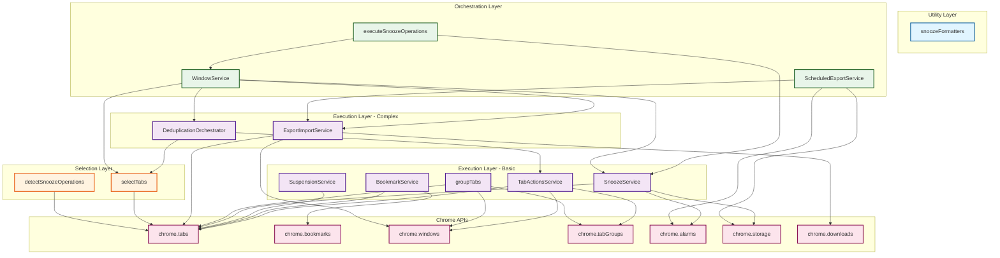

# Service Dependencies

Visual map of how TabMaster Pro's 13 services depend on each other and Chrome APIs.

## Architecture Layers

Services are organized into 4 architectural layers:

1. **Selection Layer** - Filtering and detection (read-only)
2. **Execution Layer** - State modification and operations
3. **Orchestration Layer** - Coordination of multiple services
4. **Utility Layer** - Pure helper functions

---

## Dependency Diagram



---

## Service Dependency Matrix

| Service | Layer | Depends On | Used By |
|---------|-------|------------|---------|
| **snoozeFormatters** | Utility | None (pure functions) | UI surfaces (popup, dashboard) |
| **selectTabs** | Selection | chrome.tabs | All orchestrators, rules engine |
| **detectSnoozeOperations** | Selection | chrome.tabs | executeSnoozeOperations, UI |
| **TabActionsService** | Execution | chrome.tabs, chrome.tabGroups, chrome.windows | DeduplicationOrchestrator, rules engine |
| **BookmarkService** | Execution | chrome.bookmarks, chrome.tabs | Rules engine, context menus |
| **SuspensionService** | Execution | chrome.tabs | Rules engine, bulk actions |
| **SnoozeService** | Execution | chrome.tabs, chrome.alarms, chrome.storage | WindowService, executeSnoozeOperations |
| **groupTabs** | Execution | chrome.tabs, chrome.tabGroups, chrome.windows | Rules engine, bulk actions |
| **ExportImportService** | Execution | chrome.tabs, chrome.windows, chrome.downloads | WindowService, ScheduledExportService |
| **DeduplicationOrchestrator** | Execution | selectTabs, TabActionsService | WindowService, rules engine |
| **executeSnoozeOperations** | Orchestrator | WindowService, SnoozeService | Background handlers, UI |
| **WindowService** | Orchestrator | SnoozeService, ExportImportService, selectTabs, DeduplicationOrchestrator | executeSnoozeOperations, context menus |
| **ScheduledExportService** | Orchestrator | ExportImportService, chrome.alarms, chrome.storage | Background alarm handlers |

---

## Dependency Chains

### Longest Chain: Window Snooze

```
UI Surface
  ↓
detectSnoozeOperations (Selection)
  ↓
executeSnoozeOperations (Orchestrator)
  ↓
WindowService (Orchestrator)
  ↓ (delegates to)
SnoozeService (Execution)
  ↓
chrome.tabs / chrome.alarms (Chrome API)
```

**Depth**: 6 layers

**Why so deep**: Window operations require complex orchestration - must capture window metadata, delegate tab snoozing, coordinate restoration. Each layer adds specific value.

### Scheduled Backup Chain

```
chrome.alarms (Trigger)
  ↓
ScheduledExportService (Orchestrator)
  ↓
ExportImportService (Execution)
  ↓
chrome.tabs / chrome.downloads (Chrome API)
```

**Depth**: 4 layers

**Why**: Simpler than snooze - just coordinate export timing and file management.

### Deduplication Chain

```
UI Surface
  ↓
selectTabs (Selection with duplicates filter)
  ↓
DeduplicationOrchestrator (Execution)
  ↓
TabActionsService (Execution)
  ↓
chrome.tabs (Chrome API)
```

**Depth**: 5 layers

**Why**: Requires duplicate detection (selection) then closure (execution).

---

## Important Service Relationships

### SnoozeService ↔ WindowService

**Type**: Mutual dependency

**Why**:
- `WindowService` calls `SnoozeService.snoozeTabs()` to snooze individual tabs
- `SnoozeService` calls `WindowService.cleanupOrphanedWindowMetadata()` for periodic cleanup

**Pattern**: This is acceptable because they serve different purposes:
- SnoozeService: Core snooze/wake operations
- WindowService: Window-level orchestration and metadata management

**Note**: This is the only circular dependency in the service layer.

### WindowService → ExportImportService

**Type**: Logic reuse

**Why**: WindowService reuses ExportImportService's 137-line battle-tested window creation/restoration logic for window snooze restoration.

**Pattern**: DRY principle - no code duplication, single source of truth for complex window operations.

### DeduplicationOrchestrator → selectTabs

**Type**: URL normalization

**Why**: Deduplication uses `selectTabs.normalizeUrlForDuplicates()` for consistent URL comparison across all deduplication operations.

**Pattern**: Centralized normalization logic ensures YouTube video IDs, Google searches, etc. are handled consistently.

---

## Service Isolation

### Services with Zero Service Dependencies

These services have no dependencies on other services (only Chrome APIs):

1. **snoozeFormatters** - Pure utility functions
2. **selectTabs** - Self-contained selection logic
3. **detectSnoozeOperations** - Self-contained detection
4. **TabActionsService** - Thin Chrome API wrappers
5. **BookmarkService** - Thin Chrome API wrapper
6. **SuspensionService** - Thin Chrome API wrapper
7. **groupTabs** - Self-contained grouping logic
8. **ExportImportService** - Self-contained data management

**Benefit**: These services can be tested in isolation with mocked Chrome APIs.

### Services with Service Dependencies

These services orchestrate multiple other services:

1. **SnoozeService** → WindowService (cleanup only)
2. **DeduplicationOrchestrator** → selectTabs, TabActionsService
3. **executeSnoozeOperations** → WindowService, SnoozeService
4. **WindowService** → SnoozeService, ExportImportService, selectTabs, DeduplicationOrchestrator
5. **ScheduledExportService** → ExportImportService

**Benefit**: Clear separation of orchestration from execution.

---

## Chrome API Usage Patterns

### Frequently Used APIs

1. **chrome.tabs** (10 services)
   - TabActionsService, BookmarkService, SuspensionService, SnoozeService
   - groupTabs, ExportImportService, selectTabs, detectSnoozeOperations, DEDUP, WINDOW

2. **chrome.storage** (2 services)
   - SnoozeService (tab metadata)
   - ScheduledExportService (backup metadata)

3. **chrome.alarms** (2 services)
   - SnoozeService (wake-up scheduling)
   - ScheduledExportService (backup scheduling)

### API Surface Area

| Service | Chrome APIs Used | API Count |
|---------|------------------|-----------|
| TabActionsService | tabs, tabGroups, windows | 3 |
| groupTabs | tabs, tabGroups, windows | 3 |
| ExportImportService | tabs, windows, downloads | 3 |
| SnoozeService | tabs, alarms, storage | 3 |
| ScheduledExportService | alarms, storage (+ ExportImportService) | 2 |
| BookmarkService | bookmarks, tabs | 2 |
| WindowService | (via other services) | 0 |
| SuspensionService | tabs | 1 |
| selectTabs | tabs | 1 |
| detectSnoozeOperations | tabs | 1 |
| DeduplicationOrchestrator | (via other services) | 0 |
| executeSnoozeOperations | (via other services) | 0 |
| snoozeFormatters | None | 0 |

---

## Dependency Rules

### ✅ Allowed Patterns

1. **Execution → Chrome APIs**
   - Direct Chrome API usage for operations
   - Example: `SnoozeService` → `chrome.tabs.remove()`

2. **Orchestrator → Execution Services**
   - Orchestrators coordinate execution services
   - Example: `WindowService` → `SnoozeService.snoozeTabs()`

3. **Orchestrator → Selection Services**
   - Orchestrators use selection for filtering
   - Example: `WindowService` → `selectTabs()`

4. **Execution → Selection Services**
   - Execution can use selection utilities
   - Example: `DeduplicationOrchestrator` → `selectTabs.normalizeUrlForDuplicates()`

5. **Service → Same Layer Service (limited)**
   - Allowed when reusing logic (DRY principle)
   - Example: `WindowService` → `ExportImportService` (window restoration logic)

### ❌ Forbidden Patterns

1. **Selection → Execution**
   - Selection layer is read-only, cannot modify state
   - Example: ❌ `selectTabs` → `closeTabs()`

2. **Execution → Orchestrator**
   - Execution services should be self-contained
   - Example: ❌ `SnoozeService` → `WindowService` (except cleanup)

3. **UI → Multiple Services (without orchestrator)**
   - UI should call orchestrators for complex workflows
   - Example: ❌ UI directly calling both `WindowService` and `SnoozeService`
   - Correct: UI → `executeSnoozeOperations` → coordinates services

4. **Deep Circular Dependencies**
   - Avoid circular chains (A → B → C → A)
   - Current exception: SnoozeService ↔ WindowService (shallow, justified)

---

## Extension Points

When adding new features, follow these patterns:

### Adding New Selection Logic

```javascript
// services/selection/selectMyNewCriteria.js
export async function selectTabsByCriteria(criteria) {
  // Use Chrome APIs for selection
  const tabs = await chrome.tabs.query({...});
  // Apply custom filtering
  return filtered;
}
```

**Dependencies**: Chrome APIs only

**Used By**: New orchestrators or UI surfaces

### Adding New Execution Operation

```javascript
// services/execution/MyNewOperation.js
export async function performOperation(tabIds, options) {
  // Execute operation on provided tab IDs
  for (const tabId of tabIds) {
    await chrome.tabs.someOperation(tabId, options);
  }
  return results;
}
```

**Dependencies**: Chrome APIs only (maybe selection utilities)

**Used By**: Orchestrators, rules engine, bulk actions

### Adding New Orchestrator

```javascript
// services/execution/MyComplexOrchestrator.js
import { selectTabs } from '../selection/selectTabs.js';
import { operation1 } from './Operation1Service.js';
import { operation2 } from './Operation2Service.js';

export async function orchestrateComplex(params) {
  // 1. Selection
  const tabs = await selectTabs({ criteria });

  // 2. Coordinate multiple operations
  const result1 = await operation1(tabs, params);
  const result2 = await operation2(result1.output, params);

  return { result1, result2 };
}
```

**Dependencies**: Selection services, Execution services

**Used By**: UI surfaces, background handlers

---

## Dependency Testing

### Isolated Testing (Zero Dependencies)

These services can be tested with only Chrome API mocks:

- snoozeFormatters (no mocks needed - pure functions)
- TabActionsService
- BookmarkService
- SuspensionService
- groupTabs
- ExportImportService

### Integration Testing (Service Dependencies)

These services require other service mocks:

- DeduplicationOrchestrator (needs selectTabs)
- executeSnoozeOperations (needs WindowService, SnoozeService)
- WindowService (needs SnoozeService, ExportImportService)
- ScheduledExportService (needs ExportImportService)

### Testing Strategy

```javascript
// 1. Unit test with Chrome API mocks
const mockChrome = { tabs: { query: async () => [...] } };
const result = await selectTabs({ filters }, mockChrome);

// 2. Integration test with service mocks
const mockSnoozeService = { snoozeTabs: async () => ({...}) };
const result = await WindowService.snoozeWindow(123, duration, {
  snoozeService: mockSnoozeService
});

// 3. End-to-end test with real Chrome APIs
// Use Playwright or similar for actual Chrome instance
```

---

## Diagram Legend

- **Orange boxes**: Selection layer (read-only, filtering)
- **Purple boxes**: Execution layer (state modification)
- **Green boxes**: Orchestration layer (coordination)
- **Blue boxes**: Utility layer (pure functions)
- **Pink boxes**: Chrome APIs (external dependencies)

---

## Circular Dependency Note

**Current Status**: One circular dependency exists:

```
SnoozeService ↔ WindowService
```

**Why Acceptable**:
- SnoozeService → WindowService: Only for periodic cleanup (`cleanupOrphanedWindowMetadata`)
- WindowService → SnoozeService: For core snooze operations (`snoozeTabs`)
- Different concerns: one is data management, other is orchestration
- No initialization deadlock (both are lazy-initialized)

**Alternative Considered**: Extract window metadata cleanup into separate utility service. Decided against due to tight coupling with window snooze logic.

**Monitoring**: If more circular dependencies emerge, consider architectural refactor.
