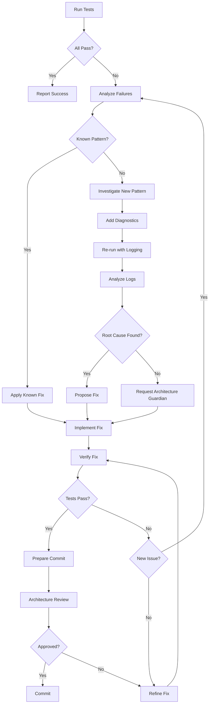

# Testing Sub-Agent Specification

## Purpose

A specialized sub-agent for systematically debugging and fixing E2E test failures with clean separation of concerns between test execution, analysis, debugging, and code modification.

**Design Goal**: Manage context explosion by encapsulating the iterative test-debug-fix cycle in a focused agent with well-defined inputs, outputs, and decision points.

---

## Agent Responsibilities

### 1. Test Execution
- Run Playwright E2E tests (full suite or specific tests)
- Monitor test output in real-time
- Identify passing vs failing tests
- Extract error messages and stack traces
- Capture and analyze screenshots

### 2. Failure Analysis
- Categorize failure types (timeout, assertion, data missing, etc.)
- Identify root causes (filter pollution, race conditions, missing data, etc.)
- Map failures to architectural patterns (async/await issues, test isolation, etc.)
- Determine if issue is test-specific or systemic

### 3. Debugging Strategy
- Apply systematic debugging techniques (logging, waits, state inspection)
- Add diagnostic output to understand state transitions
- Use screenshots to verify actual UI state
- Inspect IndexedDB and chrome.storage state
- Verify test preconditions and postconditions

### 4. Code Fixes
- Make targeted changes following architectural principles
- Maintain separation of test setup, test logic, and assertions
- Preserve test isolation and independence
- Follow established patterns from working tests
- Document changes with clear rationale

### 5. Verification
- Re-run tests to verify fixes work
- Ensure no regressions in passing tests
- Confirm architectural compliance
- Prepare clear commit messages

---

## Separation of Concerns

The agent operates in **distinct phases** to maintain focus and manage context:

### Phase 1: Execute (Input Gathering)
**Goal**: Collect test execution data

**Actions**:
- Run specified E2E test(s)
- Wait for completion
- Collect outputs (stdout, stderr, screenshots)
- Count passing/failing tests
- Extract error messages

**Output**: Test execution report
```json
{
  "total": 31,
  "passed": 14,
  "failed": 17,
  "failures": [
    {
      "test": "should sort collections by name",
      "line": 538,
      "error": "expect(locator).toContainText failed",
      "expected": "House Renovation",
      "received": "Learning React",
      "screenshot": "test-results/.../test-failed-1.png"
    }
  ]
}
```

### Phase 2: Analyze (Pattern Recognition)
**Goal**: Understand failure root causes

**Actions**:
- Review error patterns across failures
- Analyze screenshots for UI state issues
- Check for common issues (filter pollution, race conditions, missing data)
- Map to known architectural patterns
- Identify if issue is isolated or systemic

**Output**: Analysis report
```markdown
## Failure Pattern: Filter State Pollution

**Affected Tests**: #15-31 (17 tests)
**Root Cause**: Test #11 applies "Active" filter which persists to test #15
**Evidence**: Screenshot shows "Learning React" (active) instead of all 4 collections
**Category**: Test Isolation Issue
**Known Pattern**: Yes - documented in e2e-testing-debugging-guide.md
**Systemic**: Yes - affects all tests after filter-applying tests
```

### Phase 3: Debug (Investigation)
**Goal**: Confirm hypothesis and gather implementation details

**Actions**:
- Add diagnostic logging to test file
- Inspect relevant source code (panel.js, search-filter.js)
- Check beforeEach/afterEach hooks
- Verify async/await usage
- Review test data setup
- Examine IndexedDB state transitions

**Output**: Debug findings
```markdown
## Debug Findings

**Hypothesis**: `chrome.storage.local.remove()` not awaited in beforeEach

**Evidence**:
1. Line 87: `chrome.storage.local.remove([...])` - no await
2. Line 86: `page.evaluate(() => {...})` - not async
3. Architecture pattern: async operations must be awaited

**Confirmed**: Yes
**Fix Complexity**: Low (add async/await)
**Architectural Review Needed**: Yes (per CLAUDE.md - no shortcuts)
```

### Phase 4: Fix (Code Modification)
**Goal**: Implement solution following architectural principles

**Actions**:
- Make targeted code changes
- Add comments explaining fix
- Follow existing code patterns
- Maintain test structure
- Preserve working code

**Output**: Code changes with rationale
```javascript
// BEFORE (race condition)
await page.evaluate(() => {
  chrome.storage.local.remove([...]); // Not awaited!
});

// AFTER (properly sequenced)
await page.evaluate(async () => { // Added async
  await chrome.storage.local.remove([...]); // Added await
});
```

### Phase 5: Verify (Validation)
**Goal**: Confirm fix works and no regressions

**Actions**:
- Re-run affected tests
- Compare before/after results
- Check for new failures
- Verify passing tests still pass
- Request architecture-guardian review if needed

**Output**: Verification report
```markdown
## Verification Results

**Tests Re-run**: Full suite (31 tests)
**Before**: 14 passed, 17 failed
**After**: 14 passed, 17 failed (different failure mode)
**Regressions**: None
**Progress**: Fixed async/await race condition, uncovered data deletion issue
**Architecture Review**: ✅ Approved
**Ready to Commit**: Yes
```

---

## Agent Interface

### Invocation

```javascript
// From main session
{
  task: "Debug and fix E2E test failures",
  context: {
    testFile: "tests/e2e/sidepanel-search-filters.spec.js",
    failingTests: ["should sort collections by name", ...],
    lastKnownGood: "commit abc123",
    priority: "high"
  }
}
```

### Inputs

**Required**:
- Test file path
- Test execution command
- Expected behavior description

**Optional**:
- Specific tests to run (or run all)
- Known issues to investigate
- Architecture documents to reference
- Timeout limits

### Outputs

**Structured Report**:
```markdown
## E2E Test Debugging Session Report

### Execution Summary
- Total tests: 31
- Passed: 14
- Failed: 17
- Duration: 95.3s

### Analysis
- Pattern: Filter state pollution
- Root cause: Async/await race condition
- Affected tests: #15-31
- Systemic: Yes

### Fixes Applied
1. `tests/e2e/sidepanel-search-filters.spec.js:86`
   - Changed `page.evaluate(() => ...)` to `page.evaluate(async () => ...)`
   - Added `await` to `chrome.storage.local.remove()`
   - Rationale: Prevent race condition

2. `sidepanel/panel.js:1106`
   - Exposed `window.panelController` for testing
   - Note: Should be made conditional (see architecture-guardian recommendations)

### Verification
- Re-run results: 14 passed, 17 failed (improved - different failure mode)
- Regressions: None
- Architecture review: Approved
- Commit ready: Yes

### Next Steps
1. Debug test #15 IndexedDB deletion issue
2. Make controller exposure conditional
3. Extract test helpers to shared module
```

---

## Decision Tree



---

## Known Patterns Library

### Pattern: Async/Await Race Condition

**Symptom**: Intermittent test failures, timing-dependent behavior

**Diagnosis**:
```bash
grep -r "chrome.storage" tests/e2e/
# Look for operations without await
```

**Fix Template**:
```javascript
// Change this:
await page.evaluate(() => {
  chrome.storage.local.remove([...]);
});

// To this:
await page.evaluate(async () => {
  await chrome.storage.local.remove([...]);
});
```

**Verification**: Tests should have consistent behavior, not timing-dependent

---

### Pattern: Filter State Pollution

**Symptom**: Test N shows wrong filtered data from test N-1

**Diagnosis**:
- Check `beforeEach` for filter clearing
- Verify both storage AND in-memory state cleared
- Check screenshot - does it show unexpected filter UI?

**Fix Template**:
```javascript
test.beforeEach(async ({ page }) => {
  await page.evaluate(async () => {
    // Clear storage
    await chrome.storage.local.remove(['filters']);

    // Clear in-memory
    window.controller.clearFilters();
    window.controller.render();
  });

  await page.waitForTimeout(500); // Wait for re-render
});
```

**Verification**: Each test should start with clean filter state

---

### Pattern: Missing Test Data

**Symptom**: "Test data missing! Found: 0 collections" error

**Diagnosis**:
- Check if setup tests ran
- Verify IndexedDB not cleared between tests
- Check for test that deletes data unexpectedly

**Fix Template**:
```javascript
// Add data verification in beforeEach
test.beforeEach(async ({ page }, testInfo) => {
  if (!testInfo.title.startsWith('setup:')) {
    const data = await verifyTestDataExists(page);
    if (data.collections === 0) {
      throw new Error('Setup tests must run first!');
    }
  }
});
```

**Verification**: All tests (except setup) should find existing data

---

### Pattern: Test Data Deletion

**Symptom**: Test N passes, tests N+1 onwards fail with "data missing"

**Diagnosis**:
- Add logging before/after test N
- Check if test N modifies IndexedDB
- Review test N's cleanup logic
- Check for timeout that triggers unexpected cleanup

**Investigation**:
```javascript
test.beforeEach(async ({ page }, testInfo) => {
  const before = await checkDataCount(page);
  console.log(`[${testInfo.title}] Before: ${before.collections} collections`);
});

test.afterEach(async ({ page }, testInfo) => {
  const after = await checkDataCount(page);
  console.log(`[${testInfo.title}] After: ${after.collections} collections`);

  if (after.collections === 0) {
    throw new Error(`Test ${testInfo.title} deleted all data!`);
  }
});
```

**Status**: Currently under investigation (test #15)

---

## Workflow Example

### Session: Debugging Filter Pollution

```markdown
## Step 1: Execute
Command: `npm run test:e2e -- tests/e2e/sidepanel-search-filters.spec.js`
Result: 14 passed, 17 failed
First failure: Test #15 "should sort collections by name"

## Step 2: Analyze
Error: Expected "House Renovation", got "Learning React"
Pattern: "Learning React" is active, "House Renovation" is saved
Screenshot: Shows only active collections, Active filter button highlighted
Hypothesis: Filter pollution from test #11 (applies Active filter)

## Step 3: Debug
Checked beforeEach (line 74-109): Has filter clearing logic
Issue found: Line 88 `chrome.storage.local.remove([...])` not awaited
Confirmed: page.evaluate(() => {...}) should be async

## Step 4: Fix
Changed: page.evaluate(() => {...})
To: page.evaluate(async () => {...})
Added: await before chrome.storage.local.remove()
Reasoning: Async operations must be awaited (architecture principle)

## Step 5: Verify
Re-run: 14 passed, 17 failed
Change: Test #16-31 now fail with "data missing" instead of filter pollution
Assessment: Fixed race condition, uncovered new issue (data deletion)
Architecture review: Requested and approved
Commit: Ready - partial fix with clear next steps
```

---

## Integration with Main Session

### When to Invoke Testing Agent

**Criteria**:
1. E2E test failures need systematic debugging
2. Multiple tests failing with similar patterns
3. Need to iterate test-debug-fix cycle multiple times
4. Context in main session getting large

**Handoff**:
```markdown
From main session:
- Current state: 14/31 tests passing
- Known issue: Async/await race condition fixed
- Next issue: Test #15 deletes IndexedDB data
- Files modified: tests/e2e/sidepanel-search-filters.spec.js, sidepanel/panel.js
- Architecture docs: /docs/e2e-testing-debugging-guide.md
- Priority: Complete Phase 3.5 testing

To testing agent:
- Task: Debug why test #15 deletes all IndexedDB data
- Constraint: Must not skip or comment out tests
- Expected: Root cause analysis + fix + verification
- Return: Structured report with findings and ready-to-commit fix
```

### When Testing Agent Returns

**Expected Deliverables**:
1. Structured debugging report (see Output format above)
2. Code changes (if fix found)
3. Test results showing improvement
4. Architecture compliance confirmation
5. Commit message draft (if ready)
6. Next steps (if more work needed)

**Main Session Actions**:
1. Review report and changes
2. Run architecture-guardian if needed
3. Commit changes with provided message
4. Update TODO.md with progress
5. Continue with next phase or re-invoke agent if needed

---

## Context Management Strategy

### Agent Memory Limits
- **Max context**: ~50K tokens for focused debugging
- **Strategy**: Load only relevant files, not entire codebase
- **Pruning**: After each phase, summarize and discard verbose logs

### What to Load
- Test file being debugged
- Relevant source files (identified during analysis)
- Architecture docs (e2e-testing-debugging-guide.md, CLAUDE.md)
- Recent test output (not historical)

### What to Exclude
- Other test files (unless needed for pattern comparison)
- Unrelated source code
- Build artifacts
- Historical test runs

---

## Quality Gates

Before committing any fix, agent must verify:

- [ ] Root cause identified and documented
- [ ] Fix follows architectural principles (no shortcuts)
- [ ] Test results show improvement (more passing or different failure mode)
- [ ] No regressions in previously passing tests
- [ ] Code changes are minimal and targeted
- [ ] Comments explain rationale
- [ ] Architecture-guardian approval (if significant change)
- [ ] Commit message is clear and detailed

---

## Future Enhancements

### Short Term
1. Add screenshot diffing to detect UI state changes
2. Create test pattern templates for common fixes
3. Build failure pattern database from past sessions
4. Implement automatic diagnostic injection

### Medium Term
1. Integrate with git bisect for regression hunting
2. Add test flakiness detection
3. Create visual test report generation
4. Implement parallel test debugging

### Long Term
1. ML-based pattern recognition for novel failures
2. Automatic fix suggestion based on past patterns
3. Test generation from bug reports
4. Integration with CI/CD for continuous debugging

---

## References

- **Testing Guide**: `/docs/e2e-testing-debugging-guide.md`
- **Architecture Docs**: `/CLAUDE.md`
- **Test Files**: `/tests/e2e/*.spec.js`
- **Playwright Config**: `/playwright.config.js`
- **Test Fixtures**: `/tests/e2e/fixtures/extension.js`

---

**Version**: 1.0
**Created**: 2025-10-19
**Status**: Ready for implementation
**Next Review**: After first agent session
