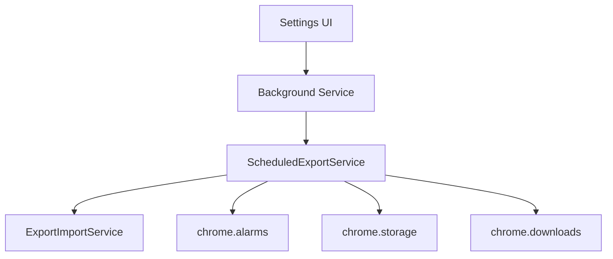

# Phase 8.4: Automatic Backup System - Implementation Plan

## Executive Summary

Phase 8.4 implements an automatic backup system that creates full session snapshots for disaster recovery and migration. Users can restore to previous states (like Time Machine), recover from mistakes, or migrate their entire session to another machine.

**User Story**: "I want automatic backups every day so if I mess up my tabs/rules/settings, I can restore to yesterday's state"

**Key Goals**:
- Schedule automatic FULL backups using chrome.alarms
- Save complete snapshots to Downloads folder via chrome.downloads API
- Track download history with minimal metadata (<5KB in storage)
- Enable full restoration from any backup

**Architectural Approach**: ScheduledExportService orchestrates scheduling and downloads, delegates to ExportImportService for snapshot creation, uses chrome.downloads API for unlimited file storage.

## 1. Architecture Analysis

### 1.1 Service Placement

The ScheduledExportService fits into the existing architecture as an **execution service** that orchestrates scheduled operations:

```
/services/
├── execution/
│   ├── ScheduledExportService.js  # NEW - Orchestrates scheduled exports
│   ├── SnoozeService.js          # Reference for alarm patterns
│   └── WindowService.js
└── ExportImportService.js        # EXISTING - Reuse for actual export logic
```

### 1.2 Service Dependencies



**Dependencies**:
- **ExportImportService**: Reuse `exportData()` for creating snapshots
- **chrome.alarms**: Schedule periodic exports (like SnoozeService)
- **chrome.storage.local**: Store snapshot metadata only
- **chrome.downloads**: Save actual snapshot files to filesystem

### 1.3 Storage Strategy

**CRITICAL DECISION**: Store FULL snapshots as downloaded files via chrome.downloads API

**What is a Snapshot**:
- FULL export with ALL data (not just metadata)
- Same format as manual exports (JSON with session + extensionData)
- Includes: tabs, windows, groups, rules, snoozed tabs, settings, statistics
- Can be imported using existing import functionality

**Storage Approach**:
- Snapshots saved to user's Downloads folder via chrome.downloads.download()
- NO storage quota limits (unlimited file storage)
- Store only tracking metadata in chrome.storage.local (<5KB total)
- Metadata tracks: downloadId, timestamp, filename, size

## 2. Service Design

### 2.1 ScheduledExportService API

```javascript
// services/execution/ScheduledExportService.js

/**
 * Enable scheduled backups with configuration
 * @param {Object} config - { enabled, frequency, retention }
 */
export async function enableScheduledExports(config)

/**
 * Disable scheduled backups
 */
export async function disableScheduledExports()

/**
 * Get current backup configuration
 * @returns {Object} Current config with enabled, frequency, retention
 */
export async function getScheduledExportConfig()

/**
 * Manually trigger a backup now
 * @returns {Object} Download metadata including downloadId
 */
export async function triggerManualBackup()

/**
 * Get list of tracked backup downloads
 * @returns {Array} Array of backup metadata with downloadIds
 */
export async function getBackupHistory()

/**
 * Delete a backup from tracking (and optionally from disk)
 * @param {number} downloadId - Chrome download ID
 * @param {boolean} deleteFile - Also delete file from disk
 */
export async function deleteBackup(downloadId, deleteFile = false)

/**
 * Clean up old backups based on retention policy
 */
async function cleanupOldBackups()

// Internal functions (not exported)
export async function handleAlarm(alarm)
async function performScheduledExport()
async function createFullSnapshot()
async function downloadSnapshot(exportData)
async function trackDownload(downloadId, metadata)
async function loadBackupMetadata()
```

### 2.2 Creating Full Snapshots

The ScheduledExportService creates **FULL exports** by delegating to ExportImportService:

```javascript
// In ScheduledExportService.js
import * as ExportImportService from '../ExportImportService.js';

async function createFullSnapshot() {
  // Get FULL state from background
  const response = await chrome.runtime.sendMessage({
    action: 'getExportState'
  });

  // Create FULL export with ALL data using existing service
  const exportData = await ExportImportService.exportData(
    {
      scope: 'all-windows',
      format: 'json',
      includeRules: true,
      includeSnoozed: true,
      includeSettings: true,
      includeStatistics: true
    },
    response.state,
    response.tabTimeData
  );

  // This is a COMPLETE snapshot that can fully restore the session
  return exportData;
}

async function downloadSnapshot(exportData) {
  // Convert FULL snapshot to JSON
  const blob = new Blob([JSON.stringify(exportData, null, 2)],
    { type: 'application/json' });
  const url = URL.createObjectURL(blob);

  // Generate filename with timestamp
  const date = new Date().toISOString().replace(/[:.]/g, '-').slice(0, 19);
  const filename = `tabmaster-backup-${date}.json`;

  // Download to user's Downloads folder
  const downloadId = await chrome.downloads.download({
    url,
    filename,
    saveAs: false // Auto-save to Downloads
  });

  // Track download metadata (NOT the snapshot data)
  await trackDownload(downloadId, {
    timestamp: Date.now(),
    filename,
    size: blob.size,
    tabCount: exportData.session.tabs.length,
    windowCount: exportData.session.windows.length,
    automatic: true
  });

  URL.revokeObjectURL(url);
  return downloadId;
}
```

### 2.3 Chrome Alarms Integration

Following SnoozeService pattern:

```javascript
const ALARM_NAME = 'scheduled_export';
const ALARM_CHECK = 'scheduled_export_cleanup';

export async function initialize() {
  // Set up alarm listener
  chrome.alarms.onAlarm.addListener(handleAlarm);

  // Load settings and configure alarms
  const settings = await loadSettings();
  if (settings.enabled) {
    await setupAlarms(settings.frequency);
  }
}

async function setupAlarms(frequency) {
  // Clear existing alarms
  await chrome.alarms.clear(ALARM_NAME);

  // Set up new alarm based on frequency
  const periods = {
    'hourly': 60,
    'daily': 60 * 24,
    'weekly': 60 * 24 * 7
  };

  if (periods[frequency]) {
    chrome.alarms.create(ALARM_NAME, {
      periodInMinutes: periods[frequency]
    });
  }

  // Daily cleanup check
  chrome.alarms.create(ALARM_CHECK, {
    periodInMinutes: 60 * 24
  });
}
```

## 3. Storage Design

### 3.1 What Gets Stored (chrome.storage.local)

**ONLY tracking metadata** - NO snapshot data itself:

```javascript
// In chrome.storage.local (<5KB total)
{
  'scheduled_export_config': {
    enabled: true,
    frequency: 'daily', // 'hourly', 'daily', 'weekly', 'custom'
    retention: 7,       // Keep last 7 backups
    lastRun: 1704067200000
  },

  'backup_history': [
    {
      downloadId: 12345,  // Chrome download ID
      timestamp: 1704067200000,
      filename: 'tabmaster-backup-2024-01-01T12-00-00.json',
      size: 1548288, // bytes for display
      tabCount: 243,
      windowCount: 3,
      automatic: true // vs manual trigger
    },
    // ... more backup records
  ]
}
```

### 3.2 Download Tracking

```javascript
async function trackDownload(downloadId, metadata) {
  const history = await loadBackupMetadata();

  // Add new backup record
  history.push({
    downloadId,
    ...metadata
  });

  // Store updated history (minimal storage impact)
  await chrome.storage.local.set({
    'backup_history': history
  });

  // Trigger cleanup if needed
  const config = await getScheduledExportConfig();
  if (config.retention > 0 && history.length > config.retention) {
    await cleanupOldBackups();
  }
}
```

### 3.3 Cleanup Policy

```javascript
async function cleanupOldBackups() {
  const config = await getScheduledExportConfig();
  const history = await loadBackupMetadata();

  if (config.retention === 0) return; // Unlimited

  // Sort by timestamp, oldest first
  history.sort((a, b) => a.timestamp - b.timestamp);

  // Identify backups to delete
  const toKeep = history.slice(-config.retention);
  const toDelete = history.slice(0, -config.retention);

  // Delete old downloads from disk (optional)
  for (const backup of toDelete) {
    try {
      // Remove file from Downloads folder
      await chrome.downloads.removeFile(backup.downloadId);
      // Remove from download history
      await chrome.downloads.erase({ id: backup.downloadId });
    } catch (error) {
      console.log(`Could not delete backup file: ${backup.filename}`);
    }
  }

  // Update stored history
  await chrome.storage.local.set({
    'backup_history': toKeep
  });

  console.log(`Cleaned up ${toDelete.length} old backups`);
}
```

## 4. UI Integration - Dashboard Export/Import View

### 4.1 Enhance Existing Export/Import View

**Location**: `/dashboard/modules/views/export-import.js` (existing file)

Add "Scheduled Backups" section to the existing Export/Import view:

```javascript
// In export-import.js - Add to renderExportImportView()

function renderScheduledBackupsSection() {
  return `
    <div class="card">
      <h3>Scheduled Backups</h3>

      <div class="backup-controls">
        <div class="setting-item">
          <label class="switch">
            <input type="checkbox" id="backupEnabled">
            <span class="slider"></span>
          </label>
          <span>Enable automatic backups</span>
        </div>

        <div class="setting-row">
          <label for="backupFrequency">Frequency:</label>
          <select id="backupFrequency">
            <option value="hourly">Hourly</option>
            <option value="daily" selected>Daily</option>
            <option value="weekly">Weekly</option>
            <option value="custom">Custom</option>
          </select>
        </div>

        <div class="setting-row">
          <label for="backupRetention">Keep last:</label>
          <input type="number" id="backupRetention" min="1" max="30" value="7">
          <span>backups</span>
        </div>

        <button id="createBackupNow" class="btn btn-primary">
          Create Backup Now
        </button>
      </div>

      <div class="backup-history">
        <h4>Backup History</h4>
        <div id="backupList" class="backup-list">
          <!-- Populated dynamically -->
        </div>
      </div>
    </div>
  `;
}
```

### 4.2 Backup History List

```javascript
// In export-import.js - Display backup history with realistic restore flow

async function renderBackupHistory() {
  const response = await chrome.runtime.sendMessage({
    action: 'getBackupHistory'
  });

  const backups = response.backups || [];
  const listElement = document.getElementById('backupList');

  if (backups.length === 0) {
    listElement.innerHTML = '<p class="empty-message">No backups yet</p>';
    return;
  }

  // Add first-time help banner if needed
  const showHelp = !localStorage.getItem('restore-help-dismissed');
  const helpBanner = showHelp ? `
    <div class="restore-help-banner">
      <p>💡 For security, Chrome requires you to select the backup file when restoring.
      Click "Restore" and we'll guide you to the right file.</p>
      <button onclick="dismissRestoreHelp()">Got it</button>
    </div>
  ` : '';

  listElement.innerHTML = helpBanner + backups.map(backup => `
    <div class="backup-item" data-download-id="${backup.downloadId}">
      <div class="backup-info">
        <div class="backup-name">
          ${backup.automatic ? '🔄' : '👤'} ${backup.filename}
        </div>
        <div class="backup-details">
          ${new Date(backup.timestamp).toLocaleString()} •
          ${backup.tabCount} tabs •
          ${(backup.size / 1024 / 1024).toFixed(1)} MB
        </div>
      </div>
      <div class="backup-actions">
        <button class="btn-icon" data-action="restore"
                title="Select this backup file to restore"
                onclick="restoreBackup(${backup.downloadId})">
          ↩️ Restore
        </button>
        <button class="btn-icon" data-action="show"
                title="Show file in Downloads folder"
                onclick="showBackupInFolder(${backup.downloadId})">
          📁 Show
        </button>
        <button class="btn-icon" data-action="delete"
                title="Remove from history"
                onclick="deleteBackup(${backup.downloadId})">
          🗑️
        </button>
      </div>
    </div>
  `).join('');

  // Bind restore handler
  attachRestoreHandlers();
}

// Restore handler with file picker (technical requirement)
async function restoreBackup(downloadId) {
  // Step 1: Get backup metadata
  const backup = backups.find(b => b.downloadId === downloadId);

  // Step 2: Validate backup still exists
  const downloads = await chrome.downloads.search({ id: downloadId });
  const exists = downloads.length > 0 && downloads[0].exists !== false;

  // Step 3: Show restore dialog with instructions
  const dialog = new RestoreDialog();
  dialog.show({
    backup,
    exists,
    filename: backup.filename.split('/').pop()
  });

  // Step 4: Use File System Access API to select file
  try {
    const [fileHandle] = await window.showOpenFilePicker({
      suggestedName: backup.filename.split('/').pop(),
      startIn: 'downloads',
      types: [{
        description: 'TabMaster Backup Files',
        accept: { 'application/json': ['.json'] }
      }]
    });

    // Step 5: Read and import file
    const file = await fileHandle.getFile();
    const contents = await file.text();
    const data = JSON.parse(contents);

    // Step 6: Import the backup data
    await chrome.runtime.sendMessage({
      action: 'importBackup',
      data: data
    });

    dialog.showSuccess();

  } catch (error) {
    if (error.name === 'AbortError') {
      // User cancelled file picker
      dialog.close();
    } else {
      dialog.showError(error.message);
    }
  }
}

// Helper to show backup file in folder
async function showBackupInFolder(downloadId) {
  try {
    await chrome.downloads.show(downloadId);
  } catch (error) {
    // If file doesn't exist, show Downloads folder
    await chrome.downloads.showDefaultFolder();
  }
}
```

### 4.3 Restore Flow Implementation (Technical Constraints Apply)

**CRITICAL**: Due to Chrome security model, we CANNOT auto-import backups. User must select file.

```javascript
// components/RestoreDialog.js - Clear user communication about file picker requirement

class RestoreDialog {
  show({ backup, exists, filename }) {
    const modal = document.createElement('div');
    modal.className = 'restore-modal';
    modal.innerHTML = `
      <div class="restore-content">
        <h2>Restore from Backup</h2>

        ${exists ? `
          <div class="file-found">
            ✅ Backup file found: <strong>${filename}</strong>
          </div>
        ` : `
          <div class="file-missing">
            ⚠️ Backup file may have been moved or deleted
          </div>
        `}

        <div class="instructions">
          <h3>To restore this backup:</h3>
          <ol>
            <li>Click "Select Backup File" below</li>
            <li>Navigate to your Downloads folder (should open automatically)</li>
            <li>Select: <code>${filename}</code></li>
            <li>Click "Open" to restore</li>
          </ol>
        </div>

        <div class="security-note">
          🔒 <strong>Why file selection is required:</strong>
          Chrome's security model prevents extensions from directly accessing
          downloaded files. This protects your privacy and security.
        </div>

        <div class="actions">
          <button id="selectFileBtn" class="btn-primary">
            Select Backup File
          </button>
          ${exists ? `
            <button id="showInFolderBtn" class="btn-secondary">
              Show in Downloads Folder
            </button>
          ` : ''}
          <button id="cancelBtn" class="btn-text">Cancel</button>
        </div>
      </div>
    `;

    document.body.appendChild(modal);
    this.bindEvents(backup);
  }

  bindEvents(backup) {
    document.getElementById('selectFileBtn')?.addEventListener('click', () => {
      this.close();
      // Parent will trigger file picker
    });

    document.getElementById('showInFolderBtn')?.addEventListener('click', async () => {
      await chrome.downloads.show(backup.downloadId);
    });

    document.getElementById('cancelBtn')?.addEventListener('click', () => {
      this.close();
    });
  }

  showSuccess() {
    const modal = document.querySelector('.restore-modal');
    modal.innerHTML = `
      <div class="restore-success">
        <div class="success-icon">✅</div>
        <h2>Restore Complete!</h2>
        <p>Your tabs, settings, and rules have been restored.</p>
        <button onclick="location.reload()" class="btn-primary">
          Refresh Dashboard
        </button>
      </div>
    `;
  }

  showError(message) {
    alert(`Restore failed: ${message}`);
    this.close();
  }

  close() {
    document.querySelector('.restore-modal')?.remove();
  }
}
```

## 5. Background Integration

### 5.1 Message Handlers

```javascript
// In background-integrated.js

// Add new message handlers for scheduled exports
case 'getScheduledExportConfig':
  const { ScheduledExportService } = await import('./services/execution/ScheduledExportService.js');
  const config = await ScheduledExportService.getScheduledExportConfig();
  sendResponse({ config });
  break;

case 'enableScheduledExports':
  await ScheduledExportService.enableScheduledExports(request.config);
  sendResponse({ success: true });
  break;

case 'disableScheduledExports':
  await ScheduledExportService.disableScheduledExports();
  sendResponse({ success: true });
  break;

case 'triggerManualBackup':
  const downloadId = await ScheduledExportService.triggerManualBackup();
  sendResponse({ success: true, downloadId });
  break;

case 'getBackupHistory':
  const backups = await ScheduledExportService.getBackupHistory();
  sendResponse({ backups });
  break;

case 'deleteBackup':
  await ScheduledExportService.deleteBackup(
    request.downloadId,
    request.deleteFile
  );
  sendResponse({ success: true });
  break;

case 'getExportState':
  // Return FULL state for creating complete snapshots
  sendResponse({
    state: {
      rules: state.rules,
      snoozedTabs: state.snoozedTabs,
      settings: state.settings,
      statistics: state.statistics
    },
    tabTimeData
  });
  break;
```

### 5.2 Alarm Handler Integration

```javascript
// In background-integrated.js, extend existing alarm handler

chrome.alarms.onAlarm.addListener(async (alarm) => {
  console.log('Alarm triggered:', alarm.name);

  if (alarm.name.startsWith('snooze_wake_')) {
    // Existing snooze handling...
  } else if (alarm.name === 'scheduled_backup' ||
             alarm.name === 'scheduled_backup_cleanup') {
    // Delegate to ScheduledExportService
    const { ScheduledExportService } = await import('./services/execution/ScheduledExportService.js');
    await ScheduledExportService.handleAlarm(alarm);
  }
});
```

### 5.3 Service Worker Restart Handling

```javascript
// In ScheduledExportService.js

let isInitialized = false;

async function ensureInitialized() {
  if (!isInitialized) {
    await initialize();
  }
}

export async function initialize() {
  // Re-register alarm listener (in case of service worker restart)
  chrome.alarms.onAlarm.addListener(handleAlarm);

  // Reload settings and setup alarms
  const settings = await loadSettings();
  if (settings.enabled) {
    await setupAlarms(settings.frequency);
  }

  isInitialized = true;
  console.log('ScheduledExportService initialized');
}
```

## 6. Testing Strategy

### 6.1 Unit Tests

Create `/tests/services/ScheduledExportService.test.js`:

```javascript
describe('ScheduledExportService', () => {
  describe('triggerManualBackup', () => {
    it('should create FULL export with all data');
    it('should download to Downloads folder');
    it('should track download metadata');
    it('should handle download errors');
  });

  describe('cleanupOldBackups', () => {
    it('should keep only N most recent backups');
    it('should delete files from Downloads');
    it('should handle missing files gracefully');
  });

  describe('alarm handling', () => {
    it('should trigger backup on scheduled_backup alarm');
    it('should run cleanup on scheduled_backup_cleanup');
    it('should not run if disabled');
  });

  describe('chrome.downloads integration', () => {
    it('should use chrome.downloads.download() API');
    it('should track download IDs correctly');
    it('should handle download events');
  });
});
```

### 6.2 Integration Tests

```javascript
describe('Automatic Backup Integration', () => {
  it('should create FULL snapshot that can be restored');
  it('should download files to Downloads folder');
  it('should restore entire session from backup');
  it('should handle 200+ tabs efficiently');
  it('should survive service worker restarts');
});
```

### 6.3 Manual Testing Checklist

- [ ] Enable scheduled backups in Dashboard Export/Import view
- [ ] Verify alarm is created (chrome://extensions → Service Worker)
- [ ] Click "Create Backup Now" button
- [ ] Verify file downloaded to Downloads folder
- [ ] Open downloaded JSON file - verify it's complete
- [ ] Check backup appears in history list
- [ ] Test restore from backup file
- [ ] Test cleanup with retention = 3 (create 4 backups)
- [ ] Restart extension and verify alarms persist
- [ ] Test with 200+ tabs for performance

## 7. Implementation Steps

### Step 1: Create ScheduledExportService (2 hours)
```bash
# Create service file
services/execution/ScheduledExportService.js

# Implement core functions:
- enableScheduledExports()
- triggerManualBackup()
- createFullSnapshot() - delegates to ExportImportService
- downloadSnapshot() - uses chrome.downloads API
- trackDownload() - stores metadata only
- cleanupOldBackups()
```

### Step 2: Enhance Dashboard Export/Import View (2 hours)
```bash
# Update dashboard/modules/views/export-import.js
# Add Scheduled Backups section
# Add backup history list
# Wire up event handlers for enable/disable/manual trigger
# Add restore from backup functionality
```

### Step 3: Background Integration (1 hour)
```bash
# Add message handlers to background-integrated.js:
- getScheduledExportConfig
- enableScheduledExports
- disableScheduledExports
- triggerManualBackup
- getBackupHistory
- deleteBackup
# Add alarm handler delegation
```

### Step 4: Chrome Downloads Integration (1 hour)
```bash
# Implement download tracking
# Handle download events
# Add cleanup with chrome.downloads.removeFile()
# Test file downloads to Downloads folder
```

### Step 5: Testing (2 hours)
```bash
# Write unit tests
# Test FULL export creation
# Test restore from backup
# Manual testing with 200+ tabs
# Verify downloads work correctly
```

### Step 6: Documentation (1 hour)
```bash
# Update user documentation
# Document backup/restore process
# Add troubleshooting guide
```

## 8. Risks and Mitigations

### Risk 1: Download Folder Access (CRITICAL CONSTRAINT)
**Impact**: Extension cannot directly read from Downloads folder - THIS IS A HARD LIMITATION
**Technical Reality**:
- Chrome extensions CANNOT read file contents from absolute paths
- chrome.downloads API provides paths but NOT file access
- File System Access API requires user file picker interaction
- No API exists to convert downloadId to readable File object

**Mitigation**:
- Use chrome.downloads API to track download metadata only
- For restore, user MUST select file via file picker (unavoidable)
- Provide clear UI instructions and filename hints
- Pre-populate file picker with expected filename
- Add "Show in Folder" button to help locate files
- Set user expectations that file selection is required for security

### Risk 2: Storage Quota for Metadata
**Impact**: Metadata could exceed storage limits
**Mitigation**:
- Store ONLY metadata (<100 bytes per backup)
- Total storage < 5KB for 50 backups
- Automatic cleanup based on retention
- No actual backup data in storage

### Risk 3: Large Export Performance
**Impact**: Creating 200+ tab exports could be slow
**Mitigation**:
- Exports run in background service worker
- chrome.downloads API is async
- Show progress for manual backups
- Use existing optimized ExportImportService

### Risk 4: Service Worker Restarts
**Impact**: Alarms could be lost, state reset
**Mitigation**:
- Use persistent chrome.alarms (survive restarts)
- Re-initialize on service worker start
- Follow SnoozeService patterns

### Risk 5: User Data Loss
**Impact**: Users might delete backups accidentally
**Mitigation**:
- Confirmation dialog for delete operations
- Backups remain in Downloads even if removed from tracking
- Clear distinction between removing tracking vs deleting file
- Option to keep files when removing from history

## 9. Key Decisions

### Decision 1: Full Snapshots, Not Metadata
**Choice**: Create FULL exports with all data
**Rationale**:
- Users need complete backups for disaster recovery
- Same format as manual exports (can be imported normally)
- True "Time Machine" functionality

### Decision 2: Chrome Downloads API for Storage
**Choice**: Save backups to Downloads folder via chrome.downloads
**Rationale**:
- Unlimited storage (no quota limits)
- Users control their files
- Standard location users expect
- No storage burden on extension

### Decision 3: UI in Dashboard Export/Import View
**Choice**: Add to existing Export/Import view, NOT settings
**Rationale**:
- Keeps all export/import functionality together
- Users expect backup controls with export features
- Maintains separation of concerns

### Decision 4: Track Download IDs Only
**Choice**: Store only download metadata in chrome.storage.local
**Rationale**:
- Minimal storage impact (<5KB)
- Can track and manage downloads
- Can clean up old files via chrome.downloads API

### Decision 5: Default Retention of 7 Backups
**Choice**: Keep last 7 backups by default
**Rationale**:
- Daily = 1 week of history
- Reasonable disk space usage
- User configurable
- Automatic cleanup prevents accumulation

## 10. Success Criteria

- [ ] Automatic backups create FULL snapshots on schedule
- [ ] Backups download to user's Downloads folder
- [ ] Each backup contains complete session data (tabs, rules, settings, etc.)
- [ ] Backups can be imported using existing import functionality
- [ ] Metadata storage uses < 5KB for 50 backups
- [ ] Cleanup respects retention policy and deletes old files
- [ ] Manual "Create Backup Now" works instantly
- [ ] UI integrated into Dashboard Export/Import view
- [ ] Service survives worker restarts
- [ ] Works efficiently with 200+ tabs

## 11. Future Enhancements (Out of Scope)

1. **Cloud Storage Integration**: Google Drive, Dropbox sync
2. **Incremental Backups**: Only store changes since last backup
3. **Backup Comparison**: Diff view between backups
4. **Selective Restore**: Choose specific tabs/windows to restore
5. **Encryption**: Password-protected backups
6. **Multiple Backup Profiles**: Different schedules for different data
7. **Smart Scheduling**: Backup on browser idle or before risky operations
8. **Compression**: ZIP format for smaller files
9. **Backup Notifications**: Toast when backup completes
10. **One-Click Restore**: Restore directly from backup history

## Architecture Guardian Review

### ✅ Architectural Strengths
- **Services-First**: All backup logic in ScheduledExportService
- **Delegation**: Reuses ExportImportService for snapshot creation
- **Separation of Concerns**: UI just displays, service handles all logic
- **Single Source of Truth**: One service owns backup scheduling
- **Explicit Operations**: Clear API with explicit parameters
- **No Duplication**: Leverages existing export functionality

### ✅ Correct Design Decisions
1. **FULL Snapshots**: Complete backups for true disaster recovery
2. **Chrome Downloads API**: Unlimited storage without quota concerns
3. **Dashboard Integration**: Keeps export/import features together
4. **Minimal Storage**: Only tracking metadata in chrome.storage
5. **Standard Export Format**: Compatible with existing import

### 🎯 Implementation Excellence
This design achieves the goal of automatic Time Machine-style backups without fighting browser limitations. By using chrome.downloads for storage and delegating to existing services, we maintain architectural integrity while delivering powerful backup functionality.

## Conclusion

Phase 8.4 implements a robust automatic backup system that creates full session snapshots for disaster recovery and migration. The design correctly uses chrome.downloads API for unlimited storage, places UI in the appropriate Dashboard location, and maintains architectural principles by delegating to existing services. The 8-hour estimate is realistic given the clean architecture and extensive reuse of existing components.